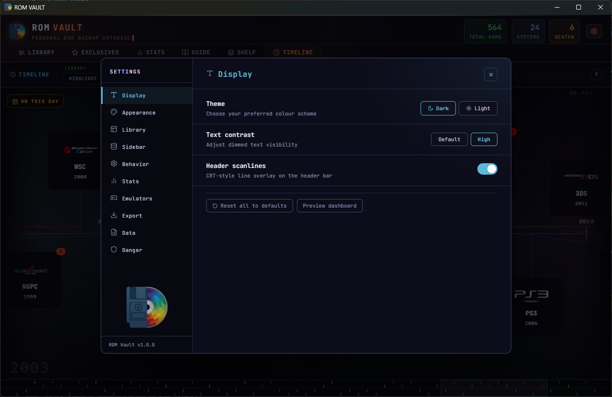

# ROM Vault

A local-first desktop application for managing a physical and digital ROM collection. Track your backlog, organize by console, manage cover art, and monitor collection completeness across platforms.

Built with Tauri 2, React 18, and SQLite. Everything runs on your machine — no accounts, no internet requirement, no telemetry, nothing sent anywhere.

---

## Screenshots


---

## Features

### Library


- Scan local folders for ROM files across any console
- Automatic format detection (ZIP, 7z, BIN, ISO, CHD, and more)
- Multi-disc ROM grouping
- Per-ROM backlog tracking: Unplayed, In Progress, Beaten, Completed
- Personal notes and custom tags per game
- Rename ROMs without touching the file on disk
- Playlist support for curated collections
- Four density levels from compact list to large card view with cover art
- Light and dark theme


---

### Cover Art
- Automatic cover art lookup via the Libretro Thumbnails database
- Custom art upload or online search per game
- Lazy-loaded thumbnails with skeleton placeholders

---

### Timeline


- Full console release history plotted on an interactive horizontal timeline
- Highlights which consoles you own ROMs for
- Filter by system type (home / handheld) or owned-only
- On This Day panel — a daily gaming history fact, with a launch button if you own the ROM

---

### Exclusives Tracker


- Browse curated lists of must-play exclusives per console
- Mark owned titles and track collection gaps
- Filter and sort by genre, ownership, or alphabetically
- AI-assisted list import for quickly populating a console's wishlist

---

### Stats


- Collection overview grouped by company and console generation
- Activity heatmap and session history
- Playtime tracking per game
- Beaten and completion rates across your library

---

### Emulation Guide


- Per-console setup guides with recommended emulators and supported formats
- Browse by company or console

---

### Shelf


- 3D shelf view with physically accurate box proportions per console
- Spine art using console branding and game logos
- Configurable camera, spacing, spine colour, and box shape per console
- Navigate by scroll, arrow keys, or gamepad

---

### Hashing and Verification
- CRC32, MD5, and SHA-1 hashing per ROM
- Extracts and hashes inner content from ZIP and 7z archives
- Hash verification via the Hasheous database
- Batch hashing across selected ROMs

---

### Export
- Export your collection as a self-contained HTML page
- Export as Markdown tables (Reddit, GitHub, forums)
- Full JSON backup and restore

---

### Settings


- Dark and light theme
- Emulator mapping per console for in-app game launching
- Configurable header stats, tab colours, and display density
- API key management for cover art sources

---

## Installation

Pre-built installers for Windows, Linux, and macOS are available on the [Releases page](https://github.com/DanesFW/rom-vault/releases). Download the file for your platform and run it — no additional software required.

| Platform | File |
|----------|------|
| Windows  | `ROM Vault_*_x64-setup.exe` |
| Linux    | `rom-vault_*_amd64.AppImage` |
| macOS    | `ROM Vault_*_universal.dmg` |

**macOS:** Right-click the `.dmg` and choose Open the first time. Apple blocks unsigned apps by default until you explicitly allow them.

**Linux:** Make the AppImage executable before running it:
```bash
chmod +x rom-vault_*.AppImage
./rom-vault_*.AppImage
```

---

## Building from Source

These steps are only needed if you want to modify or build the app yourself. Regular users should use the installers above.

**Requirements:**
- [Node.js](https://nodejs.org/) 18 or later
- [Rust](https://rustup.rs/) (stable toolchain)
- [Tauri v2 prerequisites](https://tauri.app/start/prerequisites/) for your platform

On Windows, Rust's MSVC toolchain and the Visual Studio C++ build tools are required. The Tauri prerequisites page covers this in detail.

Clone the repository and install dependencies:

```bash
git clone https://github.com/DanesFW/rom-vault.git
cd rom-vault
npm install
```

Run in development mode:

```bash
npm run tauri dev
```

Build a release binary for your current platform:

```bash
npm run tauri build
```

---

## Project Structure

```
rom-vault/
  src/                  React frontend
    components/         UI components (sidebar, rows, modals, settings)
    tabs/               Top-level tab views (Library, Exclusives, Stats, etc.)
    hooks/              State and data hooks
    data/               Static data (console list, platform logos, cover images)
  src-tauri/
    src/
      main.rs           Tauri commands (scanning, hashing, file ops, API calls)
    migrations/         SQLite migration files
  public/
    screenshots/        README screenshots
```

---

## Tech Stack

| Layer     | Technology                        |
|-----------|-----------------------------------|
| Shell     | Tauri 2                           |
| Frontend  | React 18, TypeScript, Vite        |
| Database  | SQLite via tauri-plugin-sql       |
| Styling   | Inline styles with CSS variables  |
| Hashing   | crc32fast, md-5, sha1 (Rust)      |
| Archives  | zip, sevenz-rust2 (Rust)          |
| HTTP      | reqwest with rustls (Rust)        |

---

## Data and Privacy

ROM Vault stores all data in a local SQLite database. No data is sent anywhere except for optional outbound requests you initiate:

- Cover art lookups contact the Libretro Thumbnails server and GameTDB
- Hash verification contacts Hasheous.org
- Both are opt-in actions triggered manually per game

---

## Acknowledgements

ROM Vault would not be possible without the following projects and communities.

**Cover Art**

[Libretro Thumbnails](https://github.com/libretro-thumbnails/libretro-thumbnails) — the primary source for boxart images, served from thumbnails.libretro.com. A community-maintained archive of cover art for thousands of games across every major platform.

[GameTDB](https://www.gametdb.com) — disc ID to canonical title database used to resolve Wii, GameCube, DS, and 3DS filenames to their correct artwork names.

**Hash Verification**

[Hasheous](https://hasheous.org) — an open database of ROM hashes mapped to verified game entries. Used to identify and verify ROMs by their SHA-1 checksum against No-Intro, Redump, TOSEC, and MAME dat files.

**ROM Naming Standards**

[No-Intro](https://www.no-intro.org) and [Redump](http://redump.org) — the dat file standards whose naming conventions ROM Vault follows when matching filenames to cover art and database entries.

**Platform Logos and Hardware Images**

Console logos, company logos, and hardware silhouette images used throughout the interface were sourced from the community. All trademarks and product images belong to their respective owners and are used for identification purposes only.

---

## License

MIT — see [LICENSE](LICENSE) for the full text.

The source code is MIT licensed. Third-party assets (console logos, hardware images, cover art) are the property of their respective owners and are not covered by this license.
